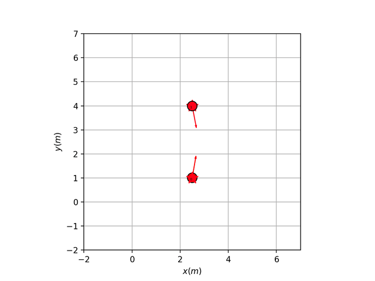
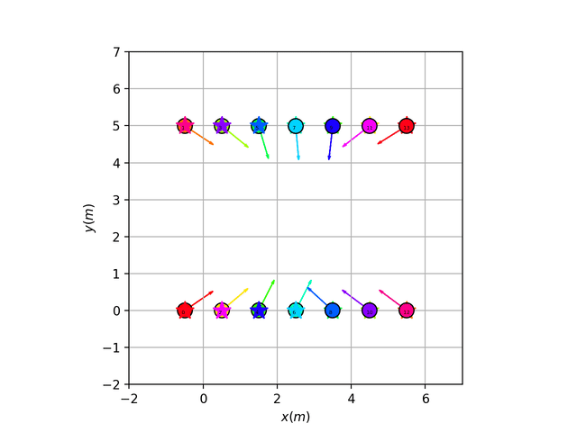
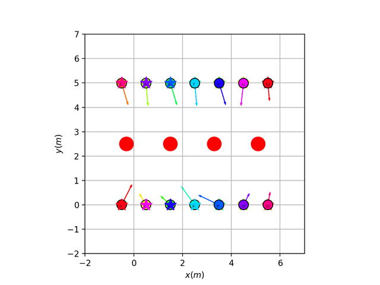

# Rice_COMP550_Algorithmic_Robotics_Project6
## Decentralized Multi-robot Coordination

========

```
  COMP/ELEC/MECH 450/550
  Project 6
  Authors: Jason Zhang(jz118), Shaun Lin(hl116), Lauren Peterson (lp57)
```

-----
Simulation
-----
The main program accept two arguments: 

map: name of the map, one of ["two", "14", "14ob"]

method: use either round search, direction priority or velocity priority, one of ["round_s", "dir_pri", "vel_pri"]

No obstacles with 2 robots
```
python3 Project6_pygame.py two round_s
```

<p align="center">  
  
</p>


No obstacles with 14 robots
```
python3 Project6_pygame.py 14 round_s
```

<p align="center">  
  
</p>


With obstacles
```
python3 Project6_pygame.py 14ob round_s
```

<p align="center">  
  
</p>


----
References 
----
* Papers on [RVO](https://www.cs.unc.edu/~geom/RVO/icra2008.pdf)
* There are [Paper review](https://medium.com/@suraj2596/paper-review-reciprocal-velocity-obstacles-for-real-time-multi-agent-navigation-aaf6adbedefd) 
